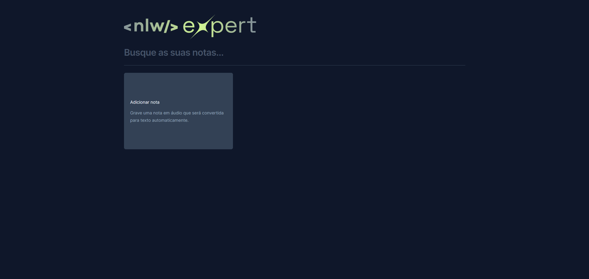

# Expert Notes-NLW
 <h1 align="center"> Notas </h1>

NLW é um evento exclusivo e gratuito, promovido pela Rocketseat para ensino de tecnologias WEB e a partir dele foi possível desenvolver um projeto para a criação de notas.  

  <a href="#-tecnologias">Tecnologias</a>&nbsp;&nbsp;&nbsp;|&nbsp;&nbsp;&nbsp;
  <a href="#-projeto">Projeto</a>&nbsp;&nbsp;&nbsp;|&nbsp;&nbsp;&nbsp;
  <a href="#memo-licença">Licença</a>

  

 

  

## 🚀 Tecnologias

Esse projeto foi desenvolvido com as seguintes tecnologias:

- HTML
- Tailwind
- React.js
- Github
- Figma

## 💻 Projeto

A aplicação Expert Notes foi criada para o usuário salvar textos sejam eles escritos ou transcritos com o uso da gravação de voz, por isso para realizar todo o projeto se fez necessáiro a utilização de diversas tecnologias e APIs.

- [Visite o projeto online]()

## :memo: Licença

Esse projeto está sob a licença MIT.

---

Feito com ♥ by Helena Lima. 

